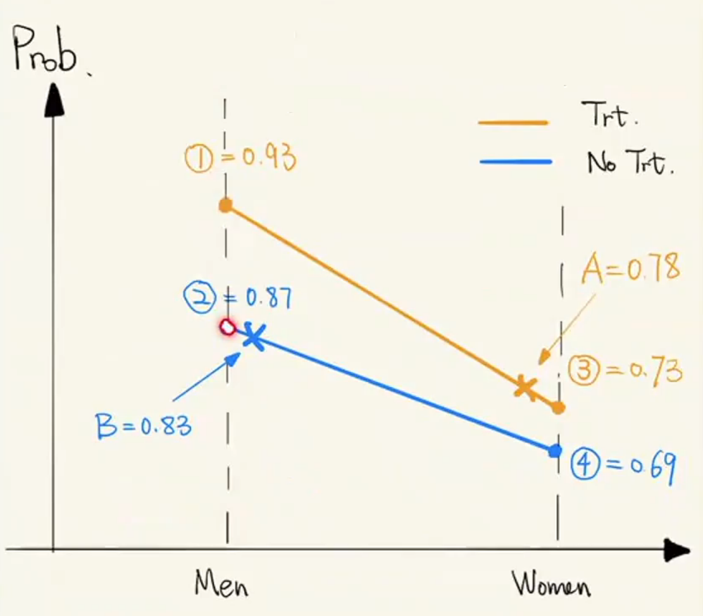

# Simpson's Paradox
Wiki definition:
- Simpson's paradox, which also goes by several other names, is a phenomenon in probability and statistics, in which a trend appears in several different groups of data but disappears or reverses when these groups are combined.

One great example here:  
  
Why paradox happens?  

--- 
# Regression
To predict Y using a function f(X) which minimizes the squared loss  
- $\min_f E(Y - f(X))$

Regression course tell us f*(x) = E(Y|X=x) is the solution.

- Linear Regression: $f^*(x) = E(Y|X=x) = x^T \beta$
- Additive Model: $f^*(x) = E(Y|X=x) = \sum_{j=1}^p f_j(x_j)$
- Kernel SVM: $f^*(x) = E(Y|X=x) = \sum_{i=1}^n \alpha_i K(x_i, x)$
- Regression Tree: $f^*(x) = E(Y|X=x) = T_\theta(x)$
- Random Forest: $f^*(x) = E(Y|X=x) = \sum_{t=1}^T T_{t, \theta_t} (x)$

---
# SCM(Structural Causal Models) Vs DAG(Directed Acyclic Graph)
  
- Exogenous (no parent) Vs Endogenous (has at least one parent)
- A SCM consists of two sets of varaibles U and V, and a set of functions f.
- Correspondence between SCM and Graph:
    - Root nodes <-> Exogenous variables U
    - Descendent nodes of root nodes <-> Endogenous variables V
    - Edges <-> The functions f
---
# Cuasation Vs Statistical Dependence

- Case 1:  
    
- Case 2: Intransitive Case  
X -> Y -> Z  
X causes Y, Y causes Z, but X might be independent to Z.

# Equivalent Models
1. Chain and fork are indistinguishable.
2. Fork/chain and collider are distinguishable.
3. Colliders with adjacent parents are indistinguishable.