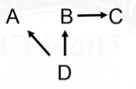
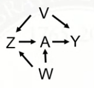

# 2.1 Confounding
## Review
- We are interested in E(Y^1 - Y^0).  
- Igonorability: Y^0, Y^1 is independent of A|X. 

## Confounding
Confounders are often defined as variables that affect treatment and affect the outcome.  
We are interested in:
- Identifying a set of variables X that will make the ignorability assumption hold. This set of variable is sufficient to control for confounding.
- Using statistical methods to control for these variables and estimate causal effects.

## Causal Graphs
- Causal Graphs will help answer the question that which variables to control for.  

---
# 2.2 Causal Graphs
## Motivation
Graphs (causal graphs or directed acyclic graphs) are considered useful for Causal inference.
- Helpful for identifying the set of variables that we need to control for to achiceve ignorability.
- Makes assumption explicit.

## Simple Graphs
A -> Y : directed graph, which shows that A affects Y.  
A - Y : undirected graph, which shows that A and Y are associated with each other. (causal direction unknown)

## Overview
Graphical models
- Encode assumptions about relationships among variables. (independent, dependent, conditionally independent, etc.)
- Can be used to derive nonparametric causal effect estimators.

## Terminology
- Basics definitions: (Node, Edge, directed, undirected, adjacent)  
A -> Y
    - This shows that A affects Y.
    - A and Y are known as nodes or vertices.
    - The link (edge) between A and Y is an arrow, which means there is a direction (directed path).
    - This is a directed graph, because all links between variables are directed.
    - Variables connected by an edge are adjacent.

- Paths  
One example here:  
  
A path is a way to get from one vertex to another, traveling along edges.
    - There are two paths from W to B:
        - W -> Z -> B 
        - W -> Z -> A -> B
    - There is one path from Z to W:
        - Z <- W

- Directed Acyclic Graphs (DAGs)
    - No undirected paths  
    - No cycles

## More Terminology
- Parents
- Childrens
- Ancestors
- Descendants

---
# 2.3 Relationship Between DAGs and Probability Distributions

## DAGs and Probability Distributions
DAGs encode assumptions about dependencies between nodes/variables.

A DAG will tell us:
- which variables are independent from each other
- which variables are conditionally independent from each other
- ways that we can factor and simplify the joint distribution

## Example 1
  
A DAG involving nodes A, B, C and D encodes assumptions about the joint distribution p(A, B, C, D).  
The DAG implies:
- P(C|A, B, D) = P(C), C is independent of all variables.
- P(B|A, B, D) = P(B|A), B is independent of (D, C)|A.
- P(B|D) != P(B), B and D are (marginally) dependent.
- P(D|A, B, C) = P(D|A)

## Example 2
  
The DAG implies:
- P(A|B, C, D) = P(A|D), A is independent of (B, C)|D.
- P(D|A, B, C) = P(D|A, B), D is independent of C|B.

## Example 3
  
The DAG implies:
- P(A|B, C, D) = P(A|C, D), A is independent of B|(C, D)
- P(D|A, B, C) = P(D|A, B), C is independent of C|(A, B)

## Decomposition of Joint Distribution
We can decompose the joint distribution by sequential conditioning only on sets of parents.
- start with roots (nodes with no parents)
- proceed down the descendant line, always conditioning on parents

Here are some examples:
- Example 1:  
  
P(A, B, C, D) = P(C)P(D)P(A|D)P(B|A)
- Example 2:  
  
P(A, B, C, D) = P(D)P(A|D)P(B|D)P(C|B)
- Example 3:  
  
P(A, B, C, D) = P(D)P(A|D)P(B|D)P(C|A,B)

## Compatibility between DAGs and Distributions
- One compatible example:  
  
P(A, B, C, D) = P(D)P(A|D)P(B|D)P(C|A,B)  
This probability function and this DAG are compatible.

DAGs that are compatible with a particular probability function are not necessarily unique.
- DAG 1: A -> B
- DAG 2: B -> A

These both convey that A and B are dependent.
- P(A, B) != P(A)P(B)

---
# 2.4 Paths and Associations
## Type of Paths
- Forks  
    D <- E -> F
- Chains  
    D -> E -> F
- Inverted forks  
    D -> E <- F

## When do paths induce associations?
If nodes A and B are on the ends of a path, they are associated (via this path) if:
- some information flows to both of them
    - Example: fork  
        - A <- E -> B  
        - A <- C <- D <- E -> G -> B  
        
        Information flows from E to A and B. A and B are not independent. Therefore, A and B are associated with each other via the path.
- information from one makes it to the other
    - Example: chain
        - A -> G -> B
        - A -> G -> D -> F -> B
## Paths that do not induce association
- Example: inverted fork:
    - A -> G <- B
    - A -> G <- D <- B
    
    (1) Information from A and B collide at G. G is known as a **[collider]**. A and B both affect G.  
    (2) Information does not flow from G to either A or B. So A and B independent (if this was the only path between them)

---
# 2.5 Conditional Independence (D-Separation)
## Blocking
Paths can be blocked by conditioning on nodes in the path.
- Chain Example: A -> G -> B  
    If we condition on G (a node in the middle of a chain), we block the path from A to B.
- Fork Example: A <- G -> B   
    If we condition on G, this path from A to B is blocked.

## Colliders
The opposite situation occurs if a collider is conditioned on.
- Inverted Fork Example: A -> G <- B  
    - Here, A and B are not associated via this path (information collides at G).  
    - However, conditioning on G induces an association between A and B. 
    - A and B are dependent, given G.

## Rules for D-Separation
A path is d-separated by a set of nodes C if:
- It contains a chain (D -> E -> F) and the middle part is in C.
- It contains a fork (D <- E -> F) and the middle part is in C.
- It contains an inverted fork (D -> E <- F) and the middle part is not in C, nor are any descendants of it.

## D-Separation
Two nodes, A and B, are d-separated by a set of nodes C if it blocks every path from A to B. Then we could say A is independent of B | C.  

Recall our goal: Y^0, Y^1 is independent of A | X.

---
# 2.6 Confounding Revisited
Confounder is a variable that affects both the treatment and the outcome.

Here are some examples:
- Example 1:  
      
    X is a confounder between A and Y.
- Example 2:  
      
    It is reasonable to argue that V is a confounder.

## Frontdoor Paths
A frontdoor path from A to Y is one that begins with an arrow emanating out of A.

Here are some examples:
- Example 1  
      
    A -> Y is a frontdoor path from A to Y.
- Example 2  
      
    A -> Z -> Y is a frontdoor path from A to Y.

Frontdoor paths capture effects of treatment.   
**Causal mediation analysis** involved understanding frontdoor paths from A to Y.

## Backdoor Paths
Backdoor paths from treatment A to outcome Y are paths from A to Y that travel through arrows going into A.
- Example 1:  
      
    A <- X -> Y is a backdoor path from A to Y.

Backdoor paths confound the relationship between A and Y. These need to be blocked. We need to block backdoor paths from treatment to outcome.

## Criteria
We will discuss two criteria for identifying sets of variables that are sufficient to control for confounding.
- Backdoor path criterion
- Disjunctive cause criterion

---
# 2.7 Backdoor Path Criterion

A Set of variables X is sufficent to control for confounding if:
- it blocks all backdoor paths from treatment to the outcome
- it does not include any descendants of treatment

This is the **backdoor path criterion**.

Note: not necessarily unique.

- Example 1:  
      
    Only 1 backdoor path: 
    - A <- V -> W -> Y.  
        It is not blocked by a collider.  
    
    Sets of variables that are sufficient to control for confounding: 
    - {V}, {W}, {V, W}

- Example 2:  
      
    Only 1 backdoor path: 
    - A <- V -> M <- W -> Y.
        - It is blocked by a collider.  No confounding.

        - However, if M is controlled for, it opens a path between V and M:  
      

    Sets of variables that are sufficient to control for confounding:
    - {}, {V}, {W}, {M, W}, {M, V}, {M, V, W}
    - but not {M}

- Example 3:  
      
    2 Backdoor paths from A to Y: 
    - A <- Z <- V -> Y  
    No colliders on this path, so controlling for either Z, V, or both is sufficient.
    - A <- W -> Z <- V -> Y  
    Z is a collider, so controlling for Z opens a path from W to V.  
        Can block this path with {}, {V}, {W}, {Z, V}, {Z, W}
    
    The following sets of variables are sufficient to control for confounding:
    - {V}, {V, Z}, {Z, W}, {V, Z, W}
    - not {Z} or {W}

- Example 4:  
      
    3 Backdoor paths:
    - 1st path:  
      
    Can block this path by Z or V.
    - 2nd path:  
      
    Can block this path by W, Z, or V.
    - 3rd path:  
      
    Can block this path by W or M.

    The following sets of variables are sufficient to control for confounding:
    - {Z, W}, {Z, M}, {Z, W, M}, {Z, V, W}, {Z, V, M}, {Z, V, W, M}, {V, W}, {V, M}, {V, W, M}

 ## Overview
 To use the backdoor path criterion for variable selection requires knowing the DAG.
 - The process of thinking through a DAG is helpful.
 - However, for many problems it might be difficult to write down a fairly accurate DAG.
---
# 2.8 Disjunctive Cause Criterion
Control for all (observed) causes of the exposure, the outcome, or both.  

Investigators do not need to know the whole graph, but rather, the list of variables that affect exposure or outcome.

## Property
If there is a set of observed variables that satisfy the backdoor path criterion, then the variables selected based on the disjunctive cause criterion will be sufficient to control for confounding.

- An example of DAG that the observed variables doesn't satisfy backdoor path criterion:  

## Overview
The disjuctive cause criterion:
- does not always select the smallest set of variables to control for
- but it is conceptually simpler
- is guaranteed to select a set of variables that are sufficient to control for confounding, if
    - such a set exsit
    - we correctly identify all of the observed causes of A and Y

## Future Work
How to control for them?
- matching
- inverse probability of treatment weighting