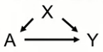
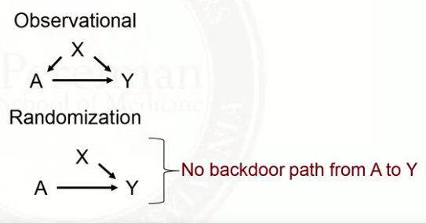
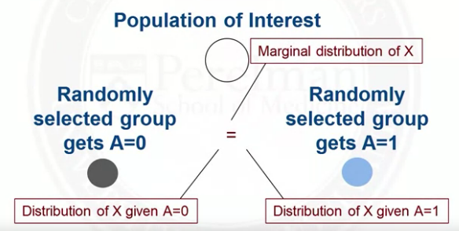
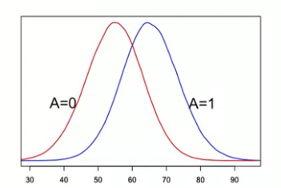

# 3.1 Observational Studies
## Set-up
Consider the following simple DAG:  
  

In this case, X is sufficient to control for confounding.  
Ignorability assumption holds:  Y^0, Y^1 is independent of A|X.

## Randomized Trails
- Treatment assignment A would be determined by a coin toss - effectively erasing the arrow from X to A.  

- The distribution of X will be the same in both treatment groups.  

- Thus, if the outcome distribution ends up differing, it will not be because of differences in X.
- X is dealt with at the design phase.

## Why not always randomize?
- Expensive
- Unethical
- People may refuse to participate
- Take time to wait for outcome data

## Observational Studies
Two type:
1. Planned, prospective, observational studies with active data collection:
    - Like trials: 
        - data collected on a common set of variables at planned times
        - outcomes carefully measured
        - study protocols
    - Unlike trails:
        - regulations much weaker, since not intervening
        - broader population eligible for the study

2. Databses, retrospective, passive data collection:
    - e.g., electronic medical records; claims; registries
    - Pros: large sample sizes; inexpensive; potential for rapid analysis
    - Cons: data qualify typically lower; no uniform standard of collection

In obervational studies, the distribution of X will differ between treatment groups.  

## Matching
Maching is a method that attempts to make an observational study more like a randomized trail.

Main idea:
- Match individuals in the treated group (A=1) to individuals in the control group (A=0) on the covariates X

Advantages of matching:  
- Controlling for confounders is achieved at the design phase - without looking at the outcome.
- Matching will reveal lack of overlap in covariate distribution. (Positivity assumption will hold in the population that can be matched)
- Once data are matched, essentially treated as if from a randomized trail.
- Outcome analysis can be simple.

# 3.2 Overview of matching