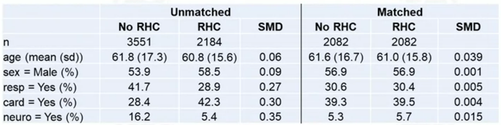

# 3.1 Observational Studies
## Set-up
Consider the following simple DAG:  
  

In this case, X is sufficient to control for confounding.  
Ignorability assumption holds:  Y^0, Y^1 is independent of A|X.

## Randomized Trails
- Treatment assignment A would be determined by a coin toss - effectively erasing the arrow from X to A.  

- The distribution of X will be the same in both treatment groups.  

- Thus, if the outcome distribution ends up differing, it will not be because of differences in X.
- X is dealt with at the design phase.

## Why not always randomize?
- Expensive
- Unethical
- People may refuse to participate
- Take time to wait for outcome data

## Observational Studies
Two type:
1. Planned, prospective, observational studies with active data collection:
    - Like trials: 
        - data collected on a common set of variables at planned times
        - outcomes carefully measured
        - study protocols
    - Unlike trails:
        - regulations much weaker, since not intervening
        - broader population eligible for the study

2. Databses, retrospective, passive data collection:
    - e.g., electronic medical records; claims; registries
    - Pros: large sample sizes; inexpensive; potential for rapid analysis
    - Cons: data qualify typically lower; no uniform standard of collection

In obervational studies, the distribution of X will differ between treatment groups.  

## Matching
Maching is a method that attempts to make an observational study more like a randomized trail.

Main idea:
- Match individuals in the treated group (A=1) to individuals in the control group (A=0) on the covariates X

Advantages of matching:  
- Controlling for confounders is achieved at the design phase - without looking at the outcome.
- Matching will reveal lack of overlap in covariate distribution. (Positivity assumption will hold in the population that can be matched)
- Once data are matched, essentially treated as if from a randomized trail.
- Outcome analysis can be simple.

---
# 3.2 Overview of Matching
## Target Population
Try to make the distribution of covariates in the control population look like that in the treated population.
- Causal effect of treatment on the treated.

## Fine Balance
- hard to find great matches
- accept some non-ideal matches if treated and control groups have same distribution of covariates: **Fine Balance** (same on marginal distribution)

## Number of matches
- One to one (pair matching)
- Many to one (K to 1)
- Variable matching

---
# 3.3 Matching Directly on Confounders
Metric of closeness:
- Mahalanobis distance  
      
    The squre root of the sum of squared distances between each covariate scaled by the covariance matrix
- Robust Mahalanobis distance  
    Motivation:
    - Outliers can create large distances between subjects
    - The ranks might be more relevant  
    
    Method:  
    - Replace each covariate value with its rank
    - Constant diagonal on covariance matrix
    - Calculate the usual Mahalanobis distance on the ranks

## Other distance measures
- If you want exact match on a few important covariates -> set the distance infinity if they are not equal
- Distance on propensity score

## What's next?
Once you have a distance score, how to select matches?
- Greedy (nearest neighbor) matching
- Optimal matching

---
# 3.4 Greedy (Nearest-Neighbor) Matching
## Steps
1. Randomly order list of treated subjects and control subjects.
2. Start with the first treated subject. Match the control with the smallest distance (this is gready).
3. Remove the matched control from the list of available matches.
4. Move on to the next treated subject. Match to the control with the smallest distance.
5. Repeat steps 3 and 4 until you have matched all treated subjects.
## Pros and Cons
- Pros:
    - Intuitive (easy to explain)
    - Computationally fast (R package: MatchIt)
- Cons:
    - Not invariant to inital order of list
    - Not optimal

## Many-to-One Matching
For k:1 matching, after everyone has 1 match, go through the list again and find 2nd matches. Repeat until k matches.

## Tradeoffs
- Pair matching (Less Bias, More Variance)
    - Closer matches
    - Faster computing time
- Many-to-one
    - Larger sample size (More Bias, Less Variance)
- Largely a bias-variance tradeoof issue

## Caliper
Exclude treated subjects for whom there does not exist a good match.

Caliper: maximum acceptable distance.

If no matches within caliper -> a sign that positivity assumption would be violated. 

Excluding these subjects makes assumption more realistic, but population becomes harder to define.

---
# 3.5 Optimal Matching
- Minimizes global distance measure
- Computationally demanding: Network flow optimization problem (research work)
- R packages: optmatch, rcbalance

## Computational feasibility
- Whether or not it is feasible to perform optimal matching depends on the size of the problem.
- Constrains can be imposed to make optimal matching computationally feasible for larger datasets: 
    - Sparse optimal matching

---
# 3.6 Assessing Balance
After you have matched, you should assess whether matching seemed to work.
- Covariate balance
    - standardized differences
- This can/should be done without looking at the outcome

Commonly, a 'Table 1' is created, where pre-matching and post-matching balance is compared.

## Hypothesis Tests and P-Values
Test for difference in means between treated and controls for each covariate: **two sample t-test**.

Drawback:
    - p-value are dependent on sample size
    - small differences in means will have a small p-value if the sample size is large. We probably do not care much if mean differences are small.

## Standardized Differences

- Does not depend on sample size
- Often, absolute value of smd is reported
- Calculate for each variable that you match on
- Rules of thumb:
    - Values < 0.1 indicate adequate balance
    - Values 0.1-0.2 are not too alarming
    - Values > 0.2 indicate serious imbalance

## Table 1
One Example:  

## SMD Plot
One Example:  

---
# 3.7 Analyzing Data after Matching
- Test for a treatment effect
- Estimate a treatment effect and confidence interval
- Methods should take matching into account

## Randomization Tests
Also known as Permutation tests and Exact tests.

- Main idea:
    - Compute test statistics from observed data.
    - Assusm null hypothesis of no treatment effect is true.
    - Randomly permuate treatment assignment within pairs and recompute test statistics.
    - Repeat many times and see how unusual observed statistics is.

- Concordant pair, Discordant pair
    - Discordant pairs are the only ones that can change.

- Distribution of test statistics  

- Same as McNemar test for paired data  

## Paired t-test
Could also use a paired t-test for continuous data.  

## Other outcome models
- Conditional logistic regression
- Stratified Cox model
- Generalized estimating equations (GEE)

---
# 3.8 Sensitivity analysis
## Possible Hidden Bias
- Overt bias: imbalance on observed covariates
- Hidden bias: unobserved variables are confounders

## Sensitivity Analysis
Main idea:
- If there is hidden bias, determine how severe it would have to be change conclusions.
    - change from statistically significant to not
    - change in direction of effect

- Let $\pi_i$ be the prob that person i receives treatment. Suppose person j and k are perfectly matched, so that their observed covaraites, $X_j$ and $X_k$, are the same. If $\pi_j = \pi_k$, then there is no hidden bias. 

- Inequality:  

- Suppose we have evidence of a treatment effect. This is under the assumption that $\Gamma=1$. 
    - We can then increase $\Gamma$ until evidence of treatment effect goes away (no longer statistically significant). 
    - If this happens when $\Gamma=1.1$, then very sensitive to unmeasured confounding (hidden bias); if does not happen until $\Gamma = 5$, then not very sensitive.

---
# 3.9 Data example in R

---
# 3.10 Propensity Score
The propensity score is the probability of receiving treatment, rather than control, given covariates X.
- $\pi_i = P(A=1|X_i)$

## Balancing Score
- Suppose 2 subjects have the same value of the propensity score, but they possibly have different covariate values X. So they were both equally likely to have been treated.
- More formally,  
$P(X=x|\pi(X) = p, A=1) = P(X=x|\pi(X)=p, A=0)$  
If we match on the propensity score, we should achieve balance.
- Conditioning on the propensity score, is conditioning on an allocation probability.

## Estimated Propensity Score
- In a randomized trial, 
    - the propensity score is generally known. 
    - P(A=1|X) = P(A=1) = 0.5.
- In an observational study,
    - the propensity score involves observed data: A and X.  -> estimate it

Estimate P(A=1|X):  
- A is binary -> logistic regression.

--- 
# 3.11 Propensity Score Matching
The propensity score is a scalar -> matching on one variable.

## Overlap
- Compare the distribution of the propensity score for treated and control subjects.  
    - good example
          
    - bad example
        
        
## Trimming Tails
Removing subjects who have extreme values of the propensity score.

- If there is a lack of overlap, trimming the tails is an option.
- Trimming the tails makes the positivity assumption more reasonable. Avoid extrapolation.

## Matching
- Matching methods: greedy or optimal.
- In practice, logit(log-odds) of the propensity score is often used, rather than the propensity score itself.
    - (0, 1) -> (-inf, inf)

## Caliper
In practice, a common choice for a caliper is the 0.2 times the standard deviation of logit of the propensity score.

1. Estimate the propensity score (logistic regression)
2. logit-tranform the propensity score
3. take the standard deviation of this transformed variable
4. Set the caliper to 0.2 times the value from 3

Smaller caliper -> less bias, more variance.

---
# 3.12 Propensity Score Matching in R

