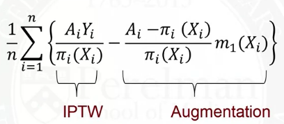

# 4.1 Intuition for Inverse Probability of Treatment Weighting (IPTW)
## Idea
Rather than match, we could use all of the data, but down-weight some and up-weight others.  

## Weighting
- For treated subjects, weight by the inverse of $P(A=1|X)$.
- FOr control subjects, weight by the inverse of $P(A=0|X)$

---
# 4.2 More Intuition for IPTW Estimation

## Motivation: Survey Sampling
- In surveys, it is common to oversample some groups relative to the population
- To estimate the population mean, we can weight the data to account for the oversample.
    - Horvitz-Thompson estimator

## Observational Studies
- Certian groups are oversampled.
    - Confounding in the original population
    - No confounding in the pseudo-population:  
    IPTW creates pseudo-population where treatment assignment no longer depends on X.

## Estimator

$E(Y^1) = \frac{\sum_{i=1}^n I(A_i=1)\frac{Y_i}{\pi_i}}{\sum_{i=1}^n \frac{I(A_i=1)}{\pi_i}}$
where $\pi_i = P(A=1|X_i)$.

---
# 4.3 Marginal Structural Models
A model for the mean of the potential outcomes.
- Marginal: model that is not conditional on the confounders (population average)
- Structural: model for potential outcomes, not observed outcomes

## Linear MSM
$E(Y^a) = \psi_0 + \psi_1 a$, a = 0, 1

## Logistic MSM for Binary Outcome
$logit\{ E(Y^a)\} = \psi_0 + \psi_1 a$, a = 0,1
- $exp(\psi_1)$ is the causal odds ratio

## MSM With Efeect Modification
$E(Y^a|V) = \psi_0 + \psi_1 a + \psi_3 V + \psi_4 aV$, a = 0, 1
- $E(Y^1|V) - E(Y^0|V) = \psi_1 + \psi_4 V$

## General MSM
$g\{E(Y^a|V)\} = h(a, V; \psi)$
- g is a link function
- h is a function specifying parametric form of a and V (typically additive, linear)

---
# 4.4 IPTW Estimation
## Estimation in Generalized Linear Models
$E(Y_i|X_i) = \mu_i = g^{-1}(X_i^T\beta)$

## Estimation in MSMs
$E(Y^a_i) = g^{-1}(\psi_0 + \psi_1 a)$

Note: not equivalent to the regression model, because of confounding:  
- $E(Y_i|A_i) = g^{-1}(\psi_0 + \psi_1 A_i)$

Estimation:  
]

## Steps
1. Estimate propensity score
2. Create weights
    - 1 divided by propensity score for treated subjects
    - 1 divided by 1 minus the propensity score for control subjects
3. Specify the MSM of interest
4. Use software to fit a weighted generalized linear model
5. Use asymptotic (sandwich) variance estimator (or bootstrapping)
    - This accounts for fact that pseudo-population might be larger than sample size.

---
# 4.5 Assessing Balance
## Balance after weighting
- Covariate balance can be checked on the weighted sample using standardized differences.
    - Table 1
    - In a plot

## Standardized Differences

## Standardized Differences after weighting
Weighted means and weighted variances.

## If imbalance after weighting
- refine propensity score model
    - interactions?
    - non-linearity?
- reassess balance

---
# 4.6 Distribution of Weights
Larger weights lead to noisier estimates of causal effects.

## Bootstrapping
One way to estimate standard errors:

1. Randomly sample, with replacement, from the original sample.
2. Estimate parameters.
3. Repeat steps 1 and 2 many times.
4. The standard deviation of the bootstrap estimates is an estimate of the standard error.

## Relationship with Positivity Assumption
An extremely large weight means that the probability of that treatment was very samll.

Near violations of positivity assumption.

## Checking Weights
- Plot:  

- Table:  

---
# 4.7 Remedies for Large Weights
## Investigative Step
- Look into why the weights are large.  
- Identify the subjects who have large weights

## Trimming the tails
Large weights occur at observations in the tails of the propensity score distribution.

Trimming Strategy:
- Remove treated subjects whose propensity scores are above the 98th percentile from the distribution among controls.
- Remove control subjects whose propensity scores are below the 2nd percentile from the distribution of treated subjects.

Reminder: trimming the tails changes the population.

## Weight Truncation
Truncating the large weights is another option.

Steps:
1. Determine a maximum allowable weight.
2. If a weight is greater than the maximum allowable, set it to the maximum allowable value.

Bias-variance trade-off:
- Truncation -> bias, smaller variance
- No truncation -> unbiased, larger variance

Truncating extremely large weights can result in estimators with lower mean squared error (MSE).

---
# 4.8 Doubly Robust Estimators (Augmented IPTW Estimation, AIPTW)
## IPTW Estimation
$$E(Y^1) = \frac{1}{n} \sum_{i=1}^n \frac{A_i Y_i}{\pi_i(X_i)}$$
If the propensity score is correctly specified, this estimator is unbiased.

## Regression-Based Estimation
$$m_1(X) = E(Y|A=1, X)$$
$$E(Y^1) = \frac{1}{n} \sum_{i=1}^n A_i Y_i + (1-A_i) m_1(X_i)$$
If outcome model m1 is correctly specified, then this estimator is unbiased.

## Doubly Robust Estimators
A doubly robust estimator is an estimator that is unbiased if either the propensity score model or the outcome regression model are correctly specified.

- Example:  

Pros:
- Can use semiparametric theory to identify best estimators.
- In general, AIPTW estimators should be more efficient than regular IPTW estimators.