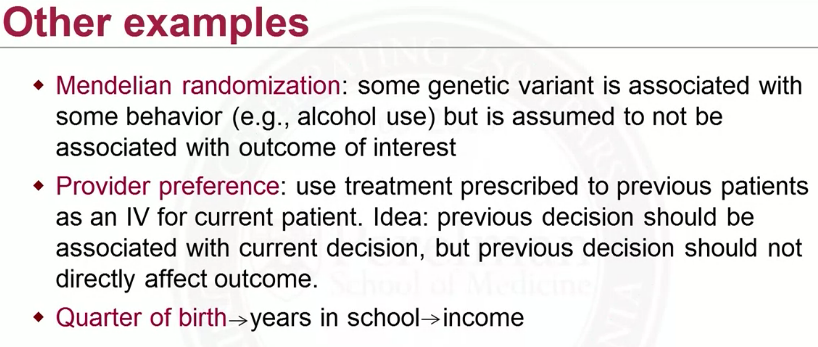

# 5.1 Introduction to Instrumental Variables
## Confounding

## Unmeasured Confounding
Suppose there are unmeasured/unobserved variables, U, that affect A and Y. Then we have unmeasured confounding.

- Ignorability assumption violated
- Bias estimates of causal effects
- cannot control for confounders if we do not observe them all

## Instrumental Variables
Instrumental variables (IV) is an alternative causl inference method that does not rely on the ignorability assumption.

- think of Z as encouragement
- Z affects treatment, but does not (directly) affect the outcome.

### Encouragement Design
An intention-to-treat analysis would focus on the **causal effect of encouragement**:
$$E(Y^{Z=1}) - E(Y^{Z=0})$$
This is a valid causal effect and sould likely be of some interest.

How about causel effect of treatment itself?  
-> This is the focus of IV methods.

### Instrumental Variables
- randomly assigned as part of the study
- believed to be randomized in nature (natural experiment)
    - mendelian randomization
    - quarter of birth
    - geographic distance to specialty care provider

---
# 5.2 Randomized Trails with Noncompliance
## Setup
Randomize trial:
- Z: randomization to treatment
- A: treatment received
- Y: outcome

Note: Not everyone assigned treatment will actually receive the treatment (non-compliance).

## DAG

- Non-compliance makes a randomized trail like an observational study.
- There could be confounding based on treatment received.
- Reasonable to assume that treatment assignment does not directly affect Y.

## Potential Treatment
- Observed data: (Z, A, Y)
- Each subject has two potential values of treatment:
    - $A^{Z=1} = A^1$
    - $A^{Z=0} = A^0$

## Causal Effect Analysis
### Causal effect of assignment on receipt
Average causal effect of **treatment assignment on treatment received**:
$$E(A^1 - A^0)$$

- If perfect compliance, this would be equal to 1.

This is estimable from the observed data, as, by randomization and consistency:
$$E(A^1) = E(A|Z=1)$$
$$E(A^0) = E(A|Z=0)$$

### Causal effect of assignment on outcome
Average causal effect of **treatment assignment on the outcome**:
$$E(Y^{Z=1} - Y^{Z=0})$$

- If perfect compliance, this would be equal to the causal effect of treatment.

This is estimable from the observed data, as, by randomization and consistency:
$$E(Y^{Z=1}) = E(Y|Z=1)$$
$$E(Y^{Z=0}) = E(Y|Z=0)$$

### Causal effect of treatment
Z can be thought of as (strong) encourage ment to receive the treatment.  
- Does this help us estimate causal effects of treatment?

---
# 5.3 Compliance Classes
## Potential Values of Treatment

Think of these subpopulations of people:
- Never-takers:  
    We would not learn anything about the effect of treatment in this subpopulation, as there is no variation in treatment received.

- Compliers(common population):  
    - In this group, treatment received is randomized.  
    - Also known as principal strata.  
    - Latent.

- Defiers (very unusual):  
    In this group treatment received is also randomized, but in the opposite way. 

- Always-takers:  
    No variation in treatment received -> no information about causal effect.

## Causal Effects
If there is unmeasured confounding, cannot marginalize over all confounders.

IV methods do not focus on the average causal effect for the population, they focus on a local average treatment effect.

### Local Average Treatment Effect
The target inference is:
$$E(Y^{Z=1}|A^0=0, A^1=1) - E(Y^{Z=0}|A^0=0, A^1=1)$$
$$= E(Y^{Z=1} - Y^{Z=0}|compliers)$$
$$= E(Y^{A=1} - Y^{A=0}|compliers)$$

- This is causal because it contrasts counterfactuals in a common population.
- Known as **complier avereage causal effect (CACE)**

### Observed Data
  
- Without additional assumption, we cannot classify each subject into one of these categories. 
- We can only narrow it down to two options.
- Identification challenge:  
    We do not know who the compliers are.

---
# 5.4 Assumptions
## Assumptions about IVs
A variable is an instrumental variable (IV) if:  
1. It is associated with the treatment.
2. It affects the outcome only through its effect on treatment. (exclusion restriction)
    - Exclusion restriction: Z cannot directly, or indirectly through its effect on U, affect the outcome.
    - If subjects are not blinded, knowledge of what they were assigned to could affect them. If clinicians are not blinded to assignment, it could affect them.
    - Need to examine this assumption carefully for any given study.

## Monotonicity Assumption
There are no defiers.
- No one consistently does the opposite of what they are told.
- It is called monotonicity because the assumption is that the probability of treatment should increase with more encouragement.

---
# 5.5 Causal Effect Identification and Estimation

### Intention to Treat Effect (ITT Effect)
$$E(Y^{Z=1} - Y^{Z=0}) = E(Y|Z=1) - E(Y|Z=0)$$

### Identification of Causal Effects
$$E(Y|Z=1) = E(Y|Z=1, \text{always takers}) P(\text{always takers})$$
$$+ E(Y|Z=1, \text{never takers}) P(\text{never takers})$$
$$+ E(Y|Z=1, \text{compliers}) P(\text{compliers})$$

Note we have
- $E(Y|Z=1, \text{always takers}) = E(Y|\text{always takers})$
- $E(Y|Z=1, \text{never takers}) = E(Y|\text{never takers})$
- $P(\text{always takers}|Z) = P(\text{always takers})$

Similar for $E(Y|Z=0)$.

Then we can simplify these equations:  

Therefore,
$$E(Y^{Z=1} - Y^{Z=0}) = E(Y|Z=1) - E(Y|Z=0)$$
$$= E(Y|Z=1, compliers)P(compliers) - E(Y|Z=0, compliers)P(compliers)$$

Which implies:  

Note that:
$$P(\text{compliers}) = E(A|Z=1) - E(A|Z=0)$$

Conclusion:  

- If perfect compliance, CACE = ITT.
- Denominator always between 0 and 1. 
- Thus, ITT <= CACE. ITT underestimates of CACE.

---
# 5.6 IVs in Observational Studies
Z can ben thought of as encouragement:
- If Z is binary, just encouragement yes or no.
- If Z is continuous, then it's a 'does' of encouragement.

We want to identify IVs that can be thought of as randomizers in natural experiments.

Key challenge: think of a variable that affects treatment but does not affect the outcome.
- Only the assumption that it affects treatment can be checked with data.
- The validity of the exclusion restriction assumption will largely need to rely on subject matter knowledge.

## Examples : Is Z a valid IV?

- It is associated with treatment received.
- Exclusion restriction?

---
# 5.7 Two Stage Least Square
A method for estimating a causal effect in the instrumental variables setting.

### Stage 1
$$A_i = \alpha_0 + Z_i\alpha_1 + \epsilon_i$$
$$\hat{A}_i = \hat{\alpha}_0 + Z_i \hat{\alpha}_1$$

### Stage 2
$$Y_i = \beta_0 + \hat{A}_i \beta_1 + \epsilon_i$$

## 2SLS Estimator
$$\beta_1 = E(Y|\hat{A} = 1) - E(Y|\hat{A} = 0) = \text{CACE}$$

## 2SLS more general

## Sensitivity Analysis
- Exclusion restriction:  
    If Z does directly affect Y by and amount $\rho$, would my conclusion change?
- Monotonicity:  
    If the proportion of defiers was $\pi$, would my conclusion change?

---
# 5.8 Weak Instruments
## Strength of IVs
The strength of an IV is how well it predicts treatment received.
- A strong instrument is highly predictive of treatment.
- A weak instrument is weakly predictive of treatment.

### Measurement
Estimate the proportion of compliers
    $$E(A|Z=1) - E(A|Z=0)$$

## Weak Instruments
A weak instrument causes problems:
- only small proportion of data have useful information about treatment.
- leads to very large variance estimates.

IV analysis might not be the best option.
